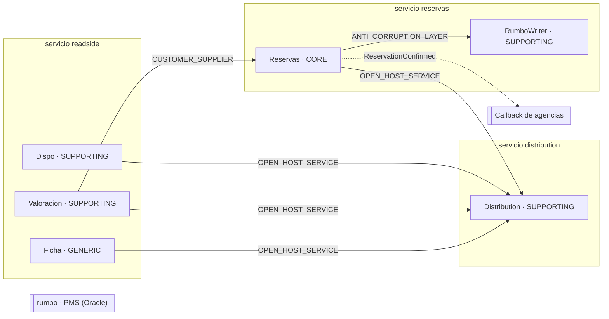
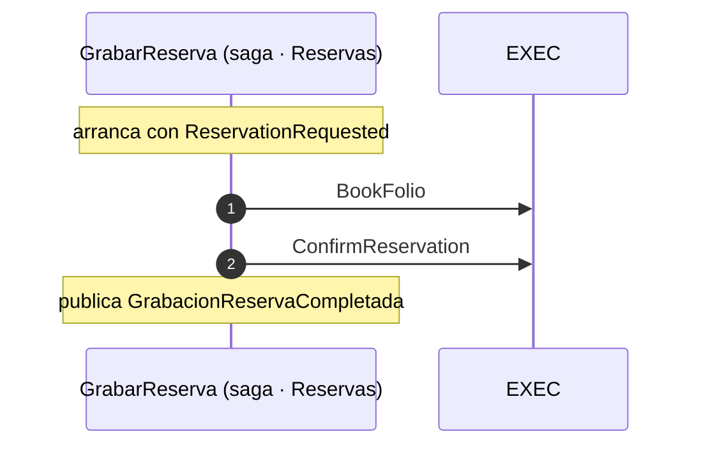
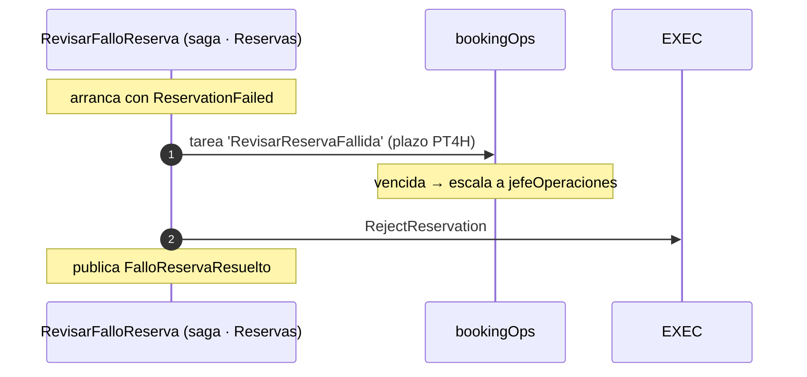
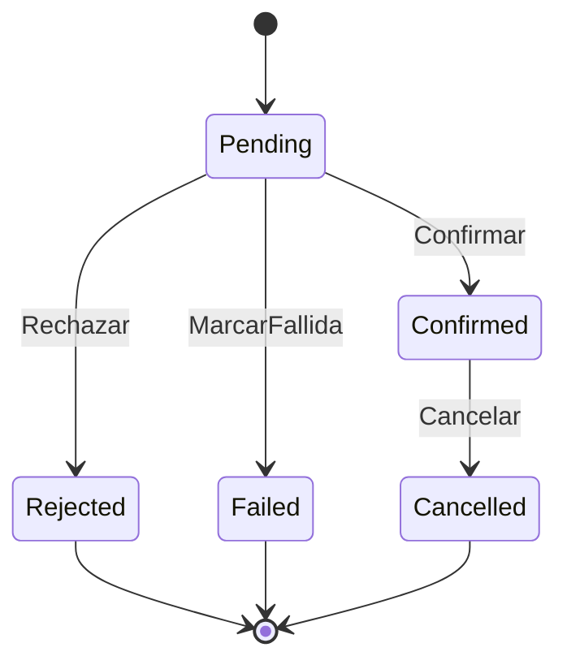

# HLA — Booking

> Documento generado desde el modelo modux — no editar a mano: es un informe de la especificación.

## 1. Contexto y objetivo

Hoy existe el read side del CQRS: un motor de disponibilidad y precios (dispo) alimentado por CDC desde el PMS legacy Oracle. Falta cerrar el write side: grabar la reserva. Se crea un servicio de dominio reservas (system of record) y una fachada de journey (distribution, un BFF) que expone EasyTravelAPI a las agencias. El flujo de la agencia es disponibilidad → valoración → reserva; el PMS legacy (rumbo) coexiste durante la transición (strangler fig).

## 2. Decisiones (ADR)

| # | Decisión | Motivo | Estado |
|---|---|---|---|
| d1 | **reservas es el system of record** — reservas es el SoR de la reserva; el PMS legacy (rumbo) se alimenta downstream. | Strangler-fig: ir sustituyendo el PMS sin big-bang. | ACCEPTED |
| d2 | **rumbo autoritativo del inventario** — rumbo sigue autoritativo del inventario (hold + folio) durante la transición. | Menos riesgo de overbooking; se reutiliza el allotment legacy. | ACCEPTED |
| d3 | **Confirmación async por saga** — La agencia recibe ONREQUEST/pending; la confirmación llega async por saga. | Tolerancia a fallos del legacy; compensación explícita. | ACCEPTED |
| d4 | **Escritura a rumbo vía SP idempotente** — La escritura a rumbo va por stored procedure idempotente que encapsula el esquema legacy. | La SP es la frontera transaccional en Oracle y el contrato del ACL. | ACCEPTED |
| d5 | **Idempotencia extremo a extremo** — Idempotencia en toda la cadena; clave SP = {reservationId}:{paso}. | Reintentos y relanzar desde la UI del engine sin doblar folio. | ACCEPTED |
| d6 | **Orquestación con workflow engine** — Saga orquestada (EventConductor), no coreografía. | Saga multi-paso con compensación + visibilidad + re-drive. | ACCEPTED |
| d7 | **Outbox siempre** — Los eventos se emiten por outbox, atómico con el cambio de estado. | Sin dual-write; EventConductor es outbox-native. | ACCEPTED |
| d8 | **distribution es un BFF stateless** — distribution es una experience-API stateless: compone el read side y reenvía el comando. | Fachada fina; el dominio no vive en el borde. | ACCEPTED |
| d9 | **Quote-token validado re-preciando** — Quote-token = stays[].rateId + selección de suplementos; reservas lo valida re-preciando. | El precio valorado es el precio reservado; EasyTravelAPI no requiere cambios. | ACCEPTED |
| d10 | **gRPC sync · eventos async · SP legacy** — Síncrono entre microservicios por gRPC; asíncrono por eventos (outbox); legacy por SP. | Contratos tipados y rápidos; sin acoplar el camino async. | ACCEPTED |
| d11 | **UI · gRPC · MCP por servicio** — Cada servicio de dominio expone UI, gRPC y MCP sobre un único core hexagonal. | Simetría Mateu: shell agrega UIs, agente agrega MCPs, BFF compone gRPC. | ACCEPTED |
| d12 | **Sin hold de cupo (book atómico)** — No hay bloqueo de cupo: sp_book_reservation hace check + decremento + folio atómicamente; un pending puede volverse rejected. | Negocio no vende opciones y el book es atómico → no hay ventana que proteger; sin compensación de hold ni reclamador de TTL. | ACCEPTED |
| d13 | **Valoración preciada · catálogo en ficha** — getHotelPriceDetails devuelve la oferta preciada (rateId + suplementos seleccionables); el catálogo descriptivo va en ficha. | Cambiar la selección = re-invocar la valoración; el BFF compone dinámico + estático. | ACCEPTED |

## 3. Vista estructural

## 4. Responsabilidades por contenedor

| Contenedor | Subdominio | Responsabilidad |
|---|---|---|
| Dispo | SUPPORTING | Read side: disponibilidad, alimentada por CDC desde rumbo. |
| Reservas | CORE | System of record del agregado Reserva; valida el quote-token re-preciando, crea Pending y emite eventos por outbox. **Lectura delegada** en Dispo vía CDC (rumbo → dispo); reservas solo expone getBooking puntual. |
| RumboWriter | SUPPORTING | Worker: consume comandos de la saga y llama a las SP idempotentes de rumbo; emite progreso/resultado. **ACL** hacia ext-rumbo. |
| Distribution | SUPPORTING | Expone EasyTravelAPI a las agencias; compone ficha+dispo+valoración y reenvía el comando bookHotel. Stateless, sin dominio. **BFF** EasyTravelAPI (/easytravel). |
| Valoracion | SUPPORTING | Read side: precio firme (rateId) y suplementos seleccionables (getRates / getHotelPriceDetails). |
| Ficha | GENERIC | Read side: catálogo descriptivo (definiciones, fotos, meal plans) — estático y cacheable. |
| rumbo · PMS (Oracle) _(externo)_ | — | PMS legacy. Autoritativo del inventario durante la transición (D2). Se escribe vía SP idempotente con ledger (D4/D5); alimenta el read side por CDC. |
| Callback de agencias _(externo)_ | — | Notificación opcional a la agencia al confirmarse la reserva (la alternativa es polling getBooking). |

## 5. Procesos de negocio

### GrabarReserva

§5.1: book → confirm, orquestado (EventConductor). El pending de la agencia (ONREQUEST) se resuelve al completar.

_SLA extremo a extremo: PT1H_

### RevisarFalloReserva

Cuando la grabación falla, operaciones revisa el caso — puede relanzar (re-drive idempotente, D5) o rechazar definitivamente.

_SLA extremo a extremo: P1D_

## 6. Ciclos de vida

### Reserva

## 7. Aspectos transversales

- **Idempotencia**: BookFolio (clave `reservationId`), BookHotel (clave `bookingReference`), RejectReservation (clave `bookingId`), FailReservation (clave `bookingId`), CancelBooking (clave `bookingId`), ConfirmReservation (clave `bookingId`).
- **Eventos**: 7 eventos de dominio, 7 publicados como integración (outbox), 7 con DLQ.
- **PII**: Reserva.holderName (PII → CRYPTO_SHRED), Reserva.holderEmail (PII → CRYPTO_SHRED), Reserva.paxNames (PII → CRYPTO_SHRED), Reserva.paymentLines (SENSITIVE → CRYPTO_SHRED), BookInput.holderName (PII → MASK), BookInput.holderEmail (PII → MASK), BookInput.paxNames (PII → MASK).
- **Tenancy**: NONE.
- **Acceso por datos** (Reservas): La agencia solo ve sus reservas — `subject.agencyCode == resource.agencyCode`.
- **KPI** (Reservas): Reservas confirmadas — COUNT por hotelId+agencyCode · DAY.
- **KPI** (Reservas): Ventas confirmadas — SUM de totalAmount por hotelId · DAY.
- **Auditoría**: Reserva.

## 8. Contratos expuestos

### EasyTravelAPI (/easytravel)

§8: contrato EasyTravelAPI vertical hotel. REST hacia fuera, gRPC hacia dentro (D10). Reenvía Idempotency-Key; no dedupe ni SoR. La COMPOSICIÓN (ficha+dispo+valoración) es código CUSTOM del desarrollador.

| Use case | REST | gRPC | MCP |
|---|---|---|---|
| GetBooking | — | Reservas.Get | ✓ |
| BookHotel | — | Reservas.Book | ✓ |
| CancelBooking | — | Reservas.Cancel | ✓ |

## 9. Puntos abiertos

_Ninguno — todas las decisiones registradas están resueltas._
